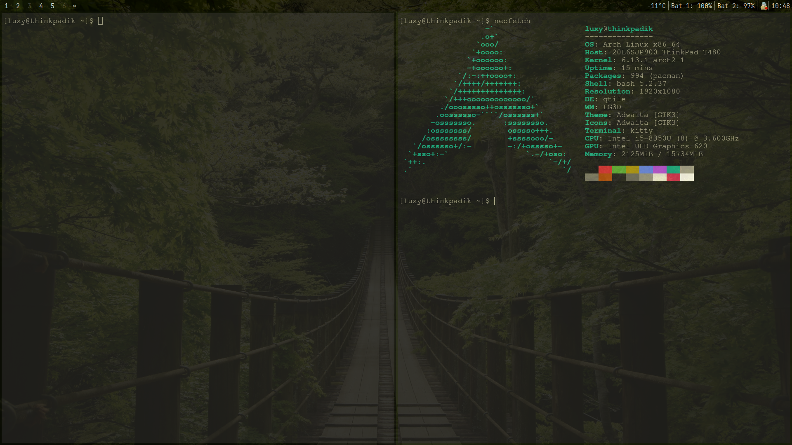

# Qtile Configuration



## 📌 Description
 This is my minimalistic config for the Qtile on xorg window manager. I use it for my thinkpad t480 laptop on arch linux, but you can easily adapt it to your needs.
 
## 🔧 How to use
---
## 📦 **1. Installing Required Packages**  
First, update your system:  
```sh
sudo pacman -Syu
```
Then, install the necessary packages:  
```sh
sudo pacman -S xorg xorg-xinit qtile python-pip kitty picom redshift git nano neovim sddm
```
---
## 📥 **2. Cloning the Configuration**  

```sh
git clone git@github.com:luxy769/qtile_config.git ~/.config
```
---

## 🖥 **3. Setting Up X Server**  
Create an **`.xinitrc`** file if it doesn’t exist:  
```sh
echo "exec qtile start" > ~/.xinitrc
chmod +x ~/.xinitrc
```

This ensures Qtile starts when you run `startx`.

Alternatively, enable **SDDM** to manage sessions:
```sh
sudo systemctl enable sddm
sudo systemctl start sddm
```

---

## 🚀 **4. Launching Qtile**  
Reboot your system, log in, and start the X server:  
```sh
startx
```
Or, if using **SDDM**, simply reboot and select Qtile from the session list.


**Enable Redshift at startup:**  
```sh
systemctl --user enable redshift
```

---

Now you have Qtile set up with my configuration. If something isn't working, check for errors using:  
```sh
sudo rm /usr/lib/python3.13/EXTERNALLY-MANAGED
pip install mypy types-setuptools
export PATH=$HOME/.local/bin:$PATH
qtile check
```


## 🎛 Basic settings

- **Modifier**: `Mod4` (Super / Windows)
- **Spawn app**: `Mod + R`
- **Move window**: `Mod + LeftClick`
- **Reduce window**: `Mod + RightClick`
- **Full size mode** `Mod + F`
- **Change layout**: `CapsLock`
- **Use CapsLock**: `Shift + CapsLock`
- **Open terminal**: `Mod + Enter`
- **Close window**: `Mod + w`
- **Switch desktop**: `Mod + 1-6`
- **Restart Qtile**: `Mod + Shift + r`
- **Exit Qtile**: `Mod + Shift + q`

## 🎨 Appearance
- Uses **Picom** for transparency, I have a minimalistic config,
  but you can easily adapt it to your needs
- Dark color scheme
  
## Kitty
- If you want Kitty to change the theme automatically to match the background color, use pywal:
```sh
pip install --user pywal
wal -i /path/to/image.jpg
```
-Selection of preset themes
```sh
nano ~/.config/kitty/kitty.conf
font_size 17.0
```
 run in therminal:
```sh
kitty +kitten themes
```


## 📂 File structure
~/.config/
kitty/    
picom/    #to eliminate tearing and add transparency
redshift/ #to reduce blue light
qtile/
├── config.py        #main Qtile
├── autostart.sh     #autostart config


## 📸 Screenshots
```
#
#
```

## 📜 License
This config is distributed under the MIT license.

---
✍ Author: [luxy769](https://github.com/luxy769)

